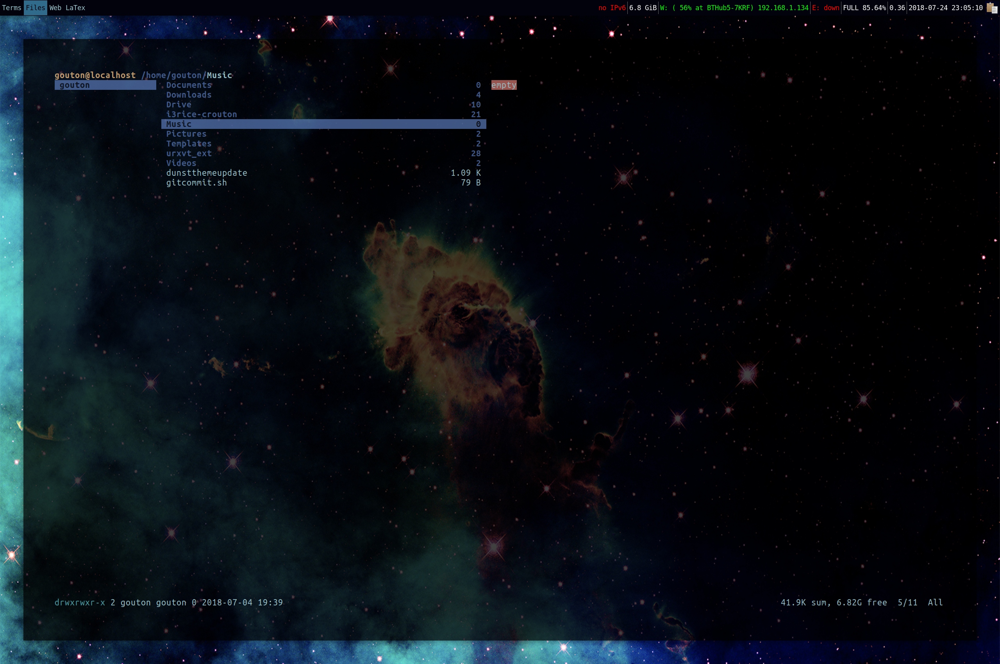
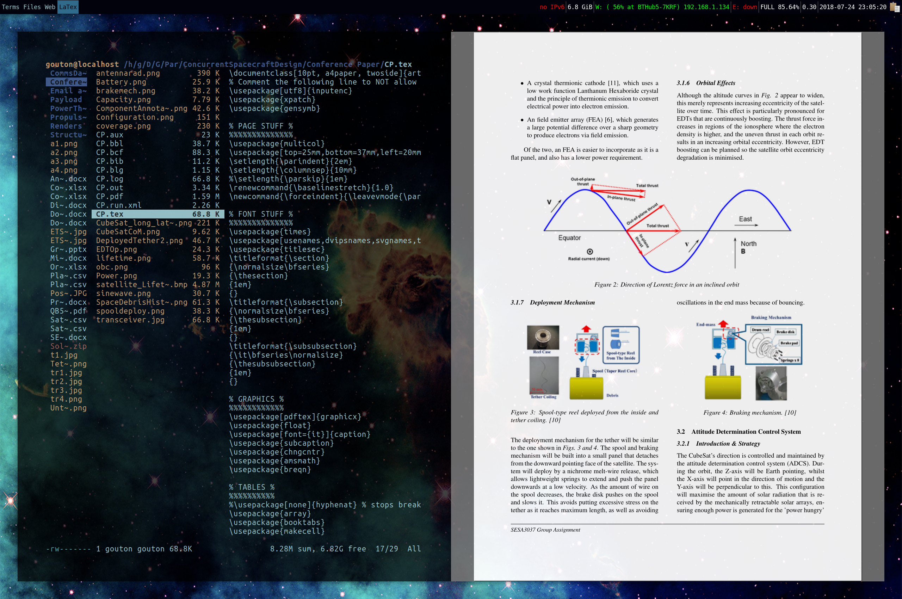

# i3rice-crouton

i3 rice for muh Chromebook Pixel 2013 using `crouton`

## Scrots







## First

Install xenial in crouton using [these instructions](https://github.com/dnschneid/crouton/wiki/i3), but instead of installing regular i3, install i3-gaps using [this guy's instructions](https://hackmd.io/s/By6mF5Rqb) and don't forget `i3status`!.

## Second

Install the following apps...

```
sudo apt-get install git wget rxvt-unicode ranger vim gedit lxappearance arandr compton rofi mupdf nautilus scrot pandoc pandoc-citeproc python-numpy python-matplotlib python-pygments
```

... and for LaTex ...


```
sudo apt-get install biber texlive-full
```

... don't forget `google-chrome-stable.deb` from [here](https://www.google.co.uk/chrome/browser/features.html?brand=CHBD&gclid=Cj0KCQjwqYfWBRDPARIsABjQRYyQvfhzrM2fnlbXYdjQkrANkRNzg4NcGRYaOoENaYF7pM8UInswO9QaAiLNEALw_wcB&gclsrc=aw.ds&dclid=CPW6iOPrnNoCFQ_3UQod1y0F8Q)

## Third

Install `grive2` using [vitalif's repo](https://github.com/vitalif/grive2) and make the necessary backup folder.

## Fourth

Download and copy and paste the necessary configs/folders from this repo!
